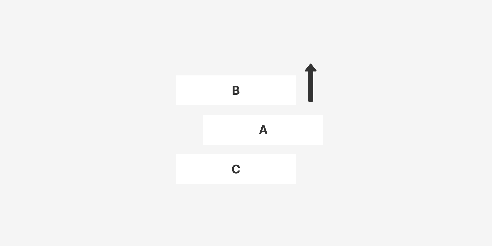
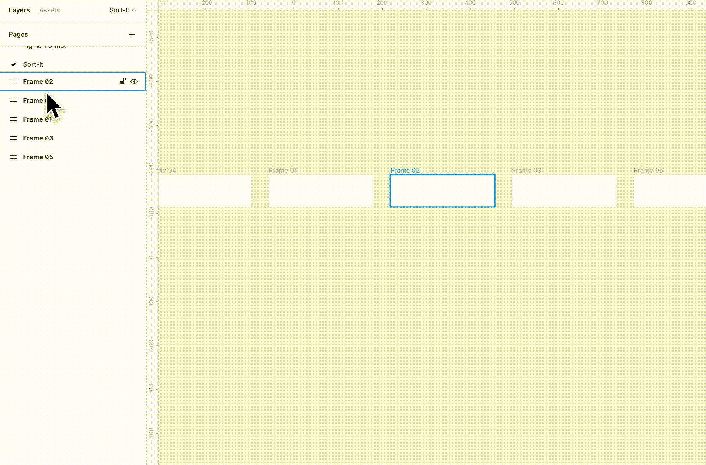

# Sort It

Figma Plugin to sort selected Frames or Layers by names.

[](LICENSE)



## Usage

1. Select multiple frames or layers.
2. Run Sort It, and select either alphabetical order (A-Z) or the opposite (Z-A).



## Installation

You can install it through the Figma App [here](https://www.figma.com/c/plugin/731324768889901500/Sort-It).

## Contribution

Pull requests are welcome. For major changes, please open an issue first to discuss what you would like to change.

#### Development

```bash
yarn watch
```

## Licence

MIT
